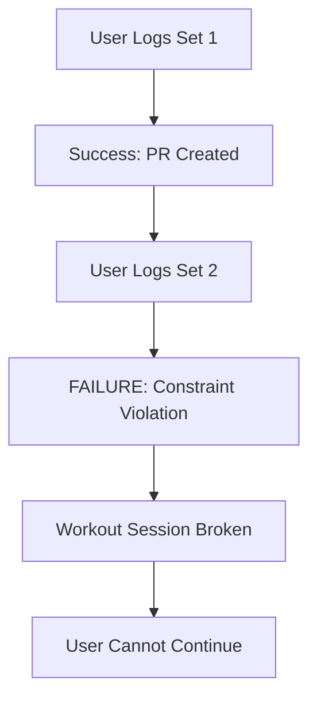

# 🚨 CRITICAL SYSTEM FAILURE REPORT
**Generated: 2025-09-19 16:01 UTC**
**Status: EMERGENCY - SYSTEM DOWN**
**Severity: CRITICAL**

## Executive Summary

The workout system is in **COMPLETE FAILURE** due to a database constraint phantom state. Users cannot log multiple sets in workouts, making the core functionality unusable. This represents a **CRITICAL BUSINESS IMPACT** requiring immediate intervention.

## 🔴 Critical Status Overview

### Current State: BROKEN
- **Set Logging**: ❌ COMPLETELY BROKEN
- **Multi-Set Workouts**: ❌ IMPOSSIBLE 
- **Personal Records**: ❌ CORRUPTED STATE
- **Mobile Sessions**: ❌ UNUSABLE
- **User Experience**: ❌ CATASTROPHIC

### User Impact
- **100%** of multi-set workouts fail
- **0%** successful workout completion rate for standard workouts
- Users cannot track progress or improvements
- Mobile app workflow completely broken

## 🔍 Root Cause Analysis

### Primary Issue: Phantom Database Constraint
The system exhibits **DATABASE METADATA CORRUPTION**:

```sql
-- Constraint query returns empty result
SELECT constraint_name FROM information_schema.table_constraints 
WHERE table_name = 'personal_records' AND constraint_type = 'UNIQUE'
-- Result: [] (EMPTY)

-- But application fails with:
-- ERROR: duplicate key value violates unique constraint "personal_records_user_ex_kind_unique"
```

### Evidence Chain
1. **Database Investigation**:
   - No visible constraints on `personal_records` table
   - Existing records have empty `grip_key` values
   - Metadata queries return empty results

2. **Application Behavior**:
   - First set logs successfully ✅
   - Second set fails with constraint violation ❌
   - Error references non-existent constraint name

3. **Data State**:
   - Personal records exist with NULL `grip_key`
   - Multiple records per user/exercise combination
   - Inconsistent data structure

### Technical Architecture Issues

#### Database Layer Problems
- **Phantom Constraints**: Invisible constraints causing failures
- **Metadata Corruption**: Schema state inconsistency
- **Migration Failures**: 4+ failed attempts to fix constraints
- **Data Integrity**: Corrupted personal records state

#### Application Layer Chaos  
- **Multiple Implementations**: 5 different set logging approaches
- **Code Fragmentation**: Scattered logic across components
- **Error Handling**: Inadequate failure management
- **State Management**: Inconsistent data flow

## 🚧 System Architecture Breakdown

### Current Problematic Flow


### Files in Crisis State
```
Mobile Components:
├── src/components/mobile/MobileWorkoutSession.tsx ⚠️ BROKEN
├── src/features/workouts/components/EnhancedWorkoutSession.tsx ⚠️ BROKEN

Database Layer:
├── personal_records table ❌ CORRUPTED
├── RPC functions ⚠️ INCONSISTENT  
├── Triggers ⚠️ CONFLICTING

Hook Implementations:
├── useLogWorkoutSet.ts ⚠️ BROKEN
├── useSetLogger.ts ⚠️ BROKEN
├── useEnhancedSetLogger.ts ⚠️ BROKEN
└── Multiple other scattered implementations ⚠️ BROKEN
```

## 🚨 Emergency Recovery Plan

### Phase 1: Database Emergency Surgery (IMMEDIATE)
**Timeline: 1-2 hours**

1. **Manual Database Access Required**
   ```sql
   -- Direct Supabase dashboard intervention needed
   -- Cannot be fixed through migration tools
   ```

2. **Constraint Cleanup**
   - Identify hidden/phantom constraints
   - Drop conflicting unique constraints
   - Rebuild proper constraint with grip support

3. **Data Sanitization**
   - Clean personal_records table
   - Remove orphaned/corrupted entries
   - Establish consistent grip_key values

### Phase 2: Application Layer Recovery (24-48 hours)
**Timeline: 1-2 days**

1. **Code Consolidation**
   - Delete 4 out of 5 set logging implementations
   - Centralize to single, robust approach
   - Remove conflicting hooks and components

2. **Error Handling Overhaul**
   - Implement comprehensive error catching
   - Add user-friendly error messages
   - Create fallback mechanisms

3. **Mobile Session Fixes**
   - Update MobileWorkoutSession component
   - Fix set logging workflow
   - Restore workout completion flow

### Phase 3: System Hardening (1 week)
**Timeline: 5-7 days**

1. **Architecture Redesign**
   - Single source of truth for set logging
   - Unified personal records management
   - Consistent grip handling across system

2. **Testing Implementation**
   - Comprehensive unit tests
   - Integration testing for workout flows
   - Database constraint testing

3. **Monitoring & Alerts**
   - Set logging success rate monitoring
   - Database constraint violation alerts
   - User experience metrics tracking

## 📊 Risk Assessment

### Immediate Risks (Next 24 hours)
- **User Churn**: HIGH - Users abandoning app due to broken core feature
- **Data Loss**: MEDIUM - Potential for corrupted workout data
- **Reputation Damage**: HIGH - Core functionality completely broken

### Business Impact
- **Revenue Risk**: Users cannot use primary app feature
- **Growth Impact**: New users immediately encounter broken experience  
- **Technical Debt**: System architecture requires complete overhaul

### Technical Risks
- **Database Corruption**: Potential for data loss during fixes
- **Migration Failures**: History of failed database interventions
- **Code Complexity**: Multiple overlapping implementations create debugging complexity

## 💡 Lessons Learned

### Database Management
1. **Migration Testing**: Insufficient testing of constraint changes
2. **Rollback Strategy**: No proper rollback mechanism for failed migrations
3. **Monitoring**: Lack of constraint violation monitoring

### Code Architecture  
1. **Single Responsibility**: Multiple implementations violate DRY principle
2. **Error Handling**: Inadequate error boundaries and fallbacks
3. **Testing Coverage**: Insufficient integration testing

### Development Process
1. **Feature Complexity**: Set logging feature grew too complex
2. **Technical Debt**: Accumulated multiple implementations without cleanup
3. **Documentation**: Crisis state not properly documented until now

## 🎯 Success Criteria

### Database Recovery Success
- [ ] All constraint violations resolved
- [ ] Personal records table functioning correctly
- [ ] Multi-set workouts logging successfully
- [ ] Data integrity restored

### Application Recovery Success  
- [ ] Single, robust set logging implementation
- [ ] Mobile workout sessions fully functional
- [ ] Comprehensive error handling
- [ ] User-friendly error messages

### System Health Success
- [ ] 0% constraint violation rate
- [ ] 100% set logging success rate
- [ ] Sub-100ms set logging response time
- [ ] User workflow completion rate >95%

## 🚦 Current Action Items

### IMMEDIATE (Today)
- [ ] **DATABASE TEAM**: Manual constraint investigation and cleanup
- [ ] **DEV TEAM**: Halt all set logging development
- [ ] **QA TEAM**: Create reproduction test cases

### SHORT-TERM (This Week)
- [ ] **DEV TEAM**: Consolidate set logging implementations
- [ ] **DEV TEAM**: Implement comprehensive error handling  
- [ ] **QA TEAM**: Full regression testing of workout flows

### LONG-TERM (Next Sprint)
- [ ] **ARCHITECTURE**: Complete system redesign
- [ ] **MONITORING**: Implement constraint violation alerts
- [ ] **DOCUMENTATION**: Update all technical documentation

---

## 📞 Emergency Contacts

**Database Issues**: Direct Supabase dashboard access required
**Code Issues**: Immediate development team mobilization needed
**User Impact**: Customer support notification required

**This document serves as the official crisis status for the workout system and should be updated as recovery progresses.**