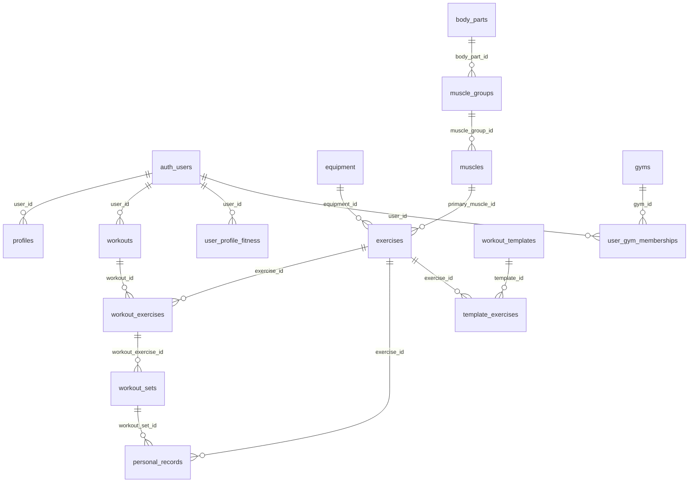

# Data Model Documentation

## Overview
This document outlines the core database schema, relationships, and data patterns for the fitness platform. Understanding these models is essential for proper system integration and development.

## Core Entities

### Users & Authentication

#### profiles
```sql
CREATE TABLE profiles (
  id UUID PRIMARY KEY DEFAULT gen_random_uuid(),
  user_id UUID REFERENCES auth.users(id) ON DELETE CASCADE,
  display_name TEXT,
  username TEXT UNIQUE,
  bio TEXT,
  avatar_url TEXT,
  is_public BOOLEAN DEFAULT true,
  created_at TIMESTAMPTZ DEFAULT now(),
  updated_at TIMESTAMPTZ DEFAULT now()
);
```

**Purpose**: Extended user profile information beyond Supabase auth
**Key Relationships**: 
- `user_id` → `auth.users.id` (Supabase managed)
**Usage**: User display information, social features, privacy settings

#### user_profile_fitness
```sql
CREATE TABLE user_profile_fitness (
  user_id UUID PRIMARY KEY REFERENCES auth.users(id),
  experience_level_id UUID REFERENCES experience_levels(id),
  sex user_sex NOT NULL,
  primary_goals TEXT[] DEFAULT '{}',
  training_frequency INTEGER,
  session_duration INTEGER,
  available_days INTEGER[],
  created_at TIMESTAMPTZ DEFAULT now(),
  updated_at TIMESTAMPTZ DEFAULT now()
);
```

**Purpose**: Fitness-specific user configuration and preferences
**Key Fields**:
- `experience_level_id`: Links to coaching parameters
- `sex`: Used for exercise selection algorithms  
- `primary_goals`: Array of fitness objectives
- `training_frequency`: Sessions per week
- `session_duration`: Target session length in minutes

## Exercise Catalog

#### exercises
```sql
CREATE TABLE exercises (
  id UUID PRIMARY KEY DEFAULT gen_random_uuid(),
  name TEXT NOT NULL,
  slug TEXT UNIQUE,
  description TEXT,
  owner_user_id UUID REFERENCES auth.users(id),
  is_public BOOLEAN DEFAULT true,
  equipment_id UUID REFERENCES equipment(id),
  body_part_id UUID REFERENCES body_parts(id),
  primary_muscle_id UUID REFERENCES muscles(id),
  secondary_muscle_group_ids UUID[],
  movement_pattern movement_pattern_type,
  complexity_score SMALLINT DEFAULT 3 CHECK (complexity_score >= 1 AND complexity_score <= 10),
  exercise_skill_level exercise_skill_level DEFAULT 'medium',
  default_grip_ids UUID[],
  contraindications JSONB DEFAULT '[]',
  capability_schema JSONB DEFAULT '{}',
  popularity_rank INTEGER,
  image_url TEXT,
  thumbnail_url TEXT,
  source_url TEXT,
  created_at TIMESTAMPTZ DEFAULT now()
);
```

**Purpose**: Core exercise database with comprehensive metadata
**Key Features**:
- **Multi-language support**: Via `exercises_translations` table
- **Equipment integration**: Links to gym equipment capabilities
- **Skill-based filtering**: Complexity and skill level scoring
- **Injury prevention**: Contraindications and safety metadata
- **User-generated content**: Users can create custom exercises

#### equipment
```sql
CREATE TABLE equipment (
  id UUID PRIMARY KEY DEFAULT gen_random_uuid(),
  slug TEXT UNIQUE NOT NULL,
  created_at TIMESTAMPTZ DEFAULT now()
);
```

**Purpose**: Equipment catalog for exercise filtering
**Related Tables**: 
- `equipment_translations` (multi-language names)
- `gym_equipment_availability` (gym-specific equipment)

#### muscles & muscle_groups
```sql
CREATE TABLE muscle_groups (
  id UUID PRIMARY KEY DEFAULT gen_random_uuid(),
  slug TEXT UNIQUE,
  body_part_id UUID REFERENCES body_parts(id),
  created_at TIMESTAMPTZ DEFAULT now()
);

CREATE TABLE muscles (
  id UUID PRIMARY KEY DEFAULT gen_random_uuid(),
  slug TEXT UNIQUE,
  muscle_group_id UUID REFERENCES muscle_groups(id),
  created_at TIMESTAMPTZ DEFAULT now()
);
```

**Purpose**: Anatomical hierarchy for exercise categorization
**Hierarchy**: `body_parts` → `muscle_groups` → `muscles`

## Workout System

#### workouts
```sql
CREATE TABLE workouts (
  id UUID PRIMARY KEY DEFAULT gen_random_uuid(),
  user_id UUID REFERENCES auth.users(id) NOT NULL,
  title TEXT,
  notes TEXT,
  started_at TIMESTAMPTZ DEFAULT now(),
  ended_at TIMESTAMPTZ,
  created_at TIMESTAMPTZ DEFAULT now()
);
```

**Purpose**: Individual workout sessions
**Lifecycle**: `started_at` (creation) → `ended_at` (completion)

#### workout_exercises
```sql
CREATE TABLE workout_exercises (
  id UUID PRIMARY KEY DEFAULT gen_random_uuid(),
  workout_id UUID REFERENCES workouts(id) ON DELETE CASCADE,
  exercise_id UUID REFERENCES exercises(id),
  order_index INTEGER NOT NULL,
  notes TEXT,
  created_at TIMESTAMPTZ DEFAULT now()
);
```

**Purpose**: Exercises within a specific workout
**Key Features**:
- **Ordering**: `order_index` for exercise sequence
- **Flexibility**: Same exercise can appear multiple times

#### workout_sets
```sql
CREATE TABLE workout_sets (
  id UUID PRIMARY KEY DEFAULT gen_random_uuid(),
  workout_exercise_id UUID REFERENCES workout_exercises(id) ON DELETE CASCADE,
  set_index INTEGER NOT NULL,
  set_kind set_type DEFAULT 'normal',
  weight NUMERIC(8,2),
  reps INTEGER,
  weight_unit weight_unit DEFAULT 'kg',
  duration_seconds INTEGER,
  distance NUMERIC(8,2),
  rpe NUMERIC(3,1) CHECK (rpe >= 1 AND rpe <= 10),
  notes TEXT,
  is_completed BOOLEAN DEFAULT false,
  completed_at TIMESTAMPTZ,
  created_at TIMESTAMPTZ DEFAULT now()
);
```

**Purpose**: Individual sets within exercises
**Set Types**: `normal`, `warmup`, `drop`, `amrap`, `top_set`, `backoff`
**Metrics**: Weight, reps, RPE, duration, distance support
**Validation**: Automatic numbering via `assign_next_set_index()` trigger

## Advanced Metrics System

#### metric_defs
```sql
CREATE TABLE metric_defs (
  id UUID PRIMARY KEY DEFAULT gen_random_uuid(),
  key TEXT UNIQUE NOT NULL,
  label TEXT NOT NULL,
  value_type metric_value_type NOT NULL,
  unit TEXT,
  enum_options TEXT[],
  created_at TIMESTAMPTZ DEFAULT now()
);
```

**Purpose**: Configurable metric definitions for exercises
**Value Types**: `number`, `text`, `boolean`, `enum`

#### exercise_metric_defs
```sql
CREATE TABLE exercise_metric_defs (
  id UUID PRIMARY KEY DEFAULT gen_random_uuid(),
  exercise_id UUID REFERENCES exercises(id),
  equipment_id UUID REFERENCES equipment(id),
  metric_id UUID REFERENCES metric_defs(id),
  is_required BOOLEAN DEFAULT false,
  default_value JSONB,
  order_index INTEGER DEFAULT 1
);
```

**Purpose**: Links exercises/equipment to available metrics
**Usage**: Cardio machines, specialized equipment tracking

#### workout_set_metric_values
```sql
CREATE TABLE workout_set_metric_values (
  id UUID PRIMARY KEY DEFAULT gen_random_uuid(),
  workout_set_id UUID REFERENCES workout_sets(id) ON DELETE CASCADE,
  metric_def_id UUID REFERENCES metric_defs(id),
  value JSONB NOT NULL,
  created_at TIMESTAMPTZ DEFAULT now()
);
```

**Purpose**: Stores actual metric values for sets
**Value Format**: 
```json
{
  "number": 45.5,     // For numeric metrics
  "text": "smooth",   // For text metrics  
  "boolean": true,    // For boolean metrics
  "enum": "medium"    // For enum metrics
}
```

## Performance Tracking

#### personal_records
```sql
CREATE TABLE personal_records (
  id UUID PRIMARY KEY DEFAULT gen_random_uuid(),
  user_id UUID REFERENCES auth.users(id) NOT NULL,
  exercise_id UUID REFERENCES exercises(id) NOT NULL,
  kind TEXT NOT NULL, -- 'heaviest', 'reps', '1RM'
  value NUMERIC NOT NULL,
  unit TEXT,
  grip_combination JSONB,
  achieved_at TIMESTAMPTZ NOT NULL,
  workout_set_id UUID REFERENCES workout_sets(id),
  created_at TIMESTAMPTZ DEFAULT now(),
  UNIQUE(user_id, exercise_id, kind, COALESCE(grip_combination, '[]'))
);
```

**Purpose**: Track personal bests across different metrics
**Automatic Updates**: `upsert_prs_after_set()` trigger maintains records
**Grip Variations**: Different grips create separate PR categories

#### materialized views for performance
```sql
-- Optimized last set lookup
CREATE MATERIALIZED VIEW mv_last_set_per_user_exercise AS
SELECT DISTINCT ON (w.user_id, we.exercise_id)
  w.user_id, we.exercise_id, ws.weight, ws.reps, ws.completed_at,
  ROW_NUMBER() OVER (PARTITION BY w.user_id, we.exercise_id ORDER BY ws.completed_at DESC) as rn
FROM workout_sets ws
JOIN workout_exercises we ON we.id = ws.workout_exercise_id
JOIN workouts w ON w.id = we.workout_id
WHERE ws.is_completed = true;

-- Optimized PR lookup  
CREATE MATERIALIZED VIEW mv_pr_weight_per_user_exercise AS
SELECT user_id, exercise_id, MAX(value) as best_weight
FROM personal_records
WHERE kind = 'heaviest'
GROUP BY user_id, exercise_id;
```

## Workout Templates

#### workout_templates
```sql
CREATE TABLE workout_templates (
  id UUID PRIMARY KEY DEFAULT gen_random_uuid(),
  user_id UUID REFERENCES auth.users(id) NOT NULL,
  name TEXT NOT NULL,
  description TEXT,
  notes TEXT,
  is_public BOOLEAN DEFAULT false,
  created_at TIMESTAMPTZ DEFAULT now(),
  updated_at TIMESTAMPTZ DEFAULT now(),
  UNIQUE(user_id, name)
);
```

#### template_exercises
```sql
CREATE TABLE template_exercises (
  id UUID PRIMARY KEY DEFAULT gen_random_uuid(),
  template_id UUID REFERENCES workout_templates(id) ON DELETE CASCADE,
  exercise_id UUID REFERENCES exercises(id),
  order_index INTEGER NOT NULL,
  default_sets INTEGER,
  target_reps INTEGER,
  target_settings JSONB DEFAULT '{}',
  notes TEXT,
  created_at TIMESTAMPTZ DEFAULT now()
);
```

**Purpose**: Reusable workout structures
**Features**: Public sharing, exercise ordering, target specifications

## Gym Management

#### gyms
```sql
CREATE TABLE gyms (
  id UUID PRIMARY KEY DEFAULT gen_random_uuid(),
  name TEXT NOT NULL,
  address TEXT,
  city TEXT,
  country TEXT,
  location geography(POINT),
  equipment_profile JSONB DEFAULT '{}',
  verified BOOLEAN DEFAULT false,
  provider TEXT NOT NULL, -- 'manual', 'google_places', 'foursquare'
  provider_place_id TEXT,
  phone TEXT,
  website TEXT,
  tz TEXT,
  created_at TIMESTAMPTZ DEFAULT now()
);
```

#### user_gym_memberships
```sql
CREATE TABLE user_gym_memberships (
  id UUID PRIMARY KEY DEFAULT gen_random_uuid(),
  user_id UUID REFERENCES auth.users(id) NOT NULL,
  gym_id UUID REFERENCES gyms(id) NOT NULL,
  is_primary BOOLEAN DEFAULT false,
  membership_type TEXT DEFAULT 'member',
  joined_at TIMESTAMPTZ DEFAULT now(),
  notes TEXT,
  UNIQUE(user_id, gym_id)
);
```

**Purpose**: User-gym relationships with equipment access
**Equipment Tracking**: Links to gym-specific equipment availability

## Social Features

#### friendships
```sql
CREATE TABLE friendships (
  id UUID PRIMARY KEY DEFAULT gen_random_uuid(),
  requester_id UUID REFERENCES auth.users(id) NOT NULL,
  addressee_id UUID REFERENCES auth.users(id) NOT NULL,
  status TEXT NOT NULL CHECK (status IN ('pending', 'accepted', 'blocked')),
  created_at TIMESTAMPTZ DEFAULT now(),
  updated_at TIMESTAMPTZ DEFAULT now(),
  UNIQUE(requester_id, addressee_id)
);
```

#### workout_shares
```sql
CREATE TABLE workout_shares (
  id UUID PRIMARY KEY DEFAULT gen_random_uuid(),
  user_id UUID REFERENCES auth.users(id) NOT NULL,
  workout_id UUID REFERENCES workouts(id) NOT NULL,
  caption TEXT,
  is_public BOOLEAN DEFAULT true,
  likes_count INTEGER DEFAULT 0,
  comments_count INTEGER DEFAULT 0,
  created_at TIMESTAMPTZ DEFAULT now()
);
```

**Purpose**: Social workout sharing with engagement metrics
**Related**: `workout_likes`, `workout_comments` for interactions

## AI Coach System

#### coach_logs
```sql
CREATE TABLE coach_logs (
  id UUID PRIMARY KEY DEFAULT gen_random_uuid(),
  user_id UUID REFERENCES auth.users(id) NOT NULL,
  function_name TEXT NOT NULL,
  step TEXT NOT NULL,
  inputs JSONB DEFAULT '{}',
  outputs JSONB DEFAULT '{}',
  success BOOLEAN DEFAULT true,
  error_message TEXT,
  execution_time_ms INTEGER,
  session_id UUID,
  metadata JSONB DEFAULT '{}',
  created_at TIMESTAMPTZ DEFAULT now()
);
```

**Purpose**: Comprehensive logging of AI interactions
**Functions**: `ai-coach`, `form-coach`, `progress-insights`
**Analytics**: Performance tracking and error analysis

## Data Quality

#### data_quality_reports
```sql
CREATE TABLE data_quality_reports (
  id UUID PRIMARY KEY DEFAULT gen_random_uuid(),
  total_exercises INTEGER DEFAULT 0,
  exercises_with_primary_muscle INTEGER DEFAULT 0,
  exercises_with_movement_pattern INTEGER DEFAULT 0,
  exercises_with_equipment_constraints INTEGER DEFAULT 0,
  primary_muscle_coverage_pct NUMERIC(5,2) DEFAULT 0,
  movement_pattern_coverage_pct NUMERIC(5,2) DEFAULT 0,
  equipment_constraints_coverage_pct NUMERIC(5,2) DEFAULT 0,
  issues_found JSONB DEFAULT '[]',
  report_type TEXT DEFAULT 'scheduled',
  created_at TIMESTAMPTZ DEFAULT now()
);
```

**Purpose**: Automated data quality monitoring
**Automation**: Nightly reports via `run_data_quality_check()`

## Key Relationships Map



## Common Query Patterns

### Get User's Recent Workouts
```sql
SELECT w.*, COUNT(ws.id) as total_sets
FROM workouts w
LEFT JOIN workout_exercises we ON we.workout_id = w.id  
LEFT JOIN workout_sets ws ON ws.workout_exercise_id = we.id
WHERE w.user_id = $1 AND w.ended_at IS NOT NULL
GROUP BY w.id
ORDER BY w.ended_at DESC
LIMIT 10;
```

### Exercise Search with Filters
```sql
SELECT e.*, eq.slug as equipment_name, m.slug as muscle_name
FROM exercises e
LEFT JOIN equipment eq ON eq.id = e.equipment_id
LEFT JOIN muscles m ON m.id = e.primary_muscle_id  
WHERE e.is_public = true
  AND ($1::uuid IS NULL OR e.equipment_id = $1)
  AND ($2::uuid IS NULL OR e.primary_muscle_id = $2)
  AND ($3::text IS NULL OR e.name ILIKE '%' || $3 || '%')
ORDER BY e.popularity_rank NULLS LAST, e.name
LIMIT 20 OFFSET $4;
```

### Personal Records with Exercise Names
```sql
SELECT pr.*, e.name as exercise_name
FROM personal_records pr
JOIN exercises e ON e.id = pr.exercise_id
WHERE pr.user_id = $1
ORDER BY pr.achieved_at DESC;
```

## Performance Considerations

### Indexes
- All foreign keys have automatic indexes
- Compound indexes on frequent query patterns:
  - `(user_id, created_at)` for user-scoped time queries
  - `(exercise_id, is_public)` for exercise searches
  - `(workout_id, order_index)` for workout ordering

### Materialized Views
- `mv_last_set_per_user_exercise`: Fast last set lookup
- `mv_pr_weight_per_user_exercise`: Optimized PR queries
- Refreshed via `refresh_exercise_views()` function

### RLS Policies
All tables have appropriate Row Level Security:
- User-scoped data: `user_id = auth.uid()`
- Public data: Available to authenticated users
- Admin data: `is_admin(auth.uid())` function checks

## Data Migration Patterns

### Adding New Metrics
```sql
-- 1. Add metric definition
INSERT INTO metric_defs (key, label, value_type, unit)
VALUES ('heart_rate', 'Heart Rate', 'number', 'bpm');

-- 2. Link to equipment
INSERT INTO exercise_metric_defs (equipment_id, metric_id, is_required)
SELECT e.id, md.id, false
FROM equipment e, metric_defs md  
WHERE e.slug = 'treadmill' AND md.key = 'heart_rate';
```

### Exercise Import
```sql
-- Import from external source
INSERT INTO exercises (name, description, equipment_id, primary_muscle_id)
SELECT 
  source.name,
  source.description,
  eq.id,
  m.id
FROM external_exercise_source source
JOIN equipment eq ON eq.slug = source.equipment_slug
JOIN muscles m ON m.slug = source.muscle_slug
WHERE NOT EXISTS (
  SELECT 1 FROM exercises e WHERE e.name = source.name
);
```